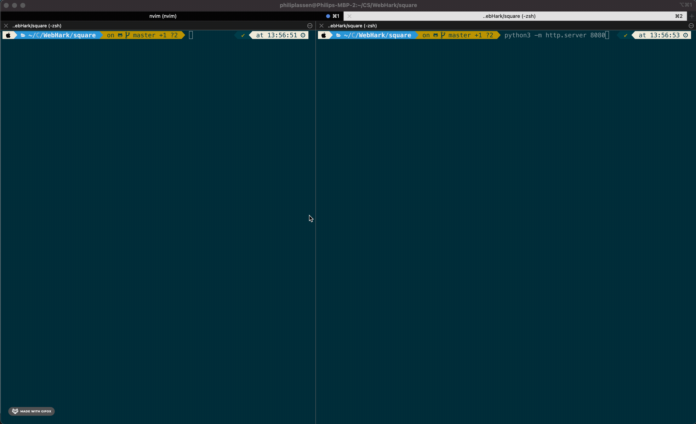

In order to run this launch a simple web server.

First build with Make
```
make
```
Then launch a simple web server
```
python3 http.server 8080
```
Then open `http://localhost:8080/square.html` and try it out. 


